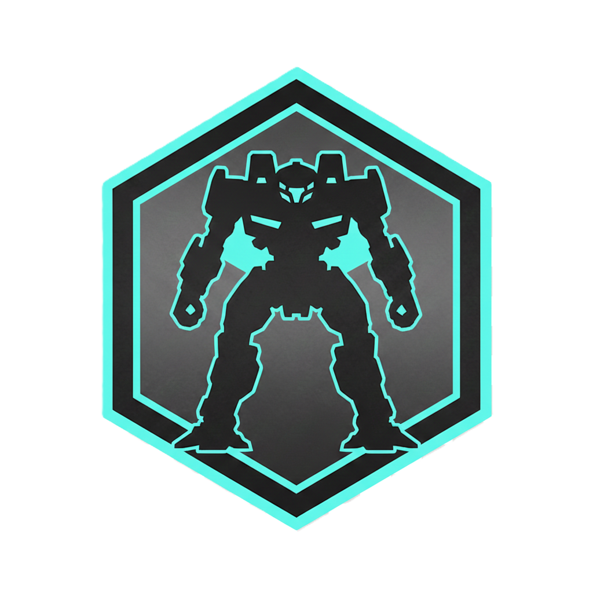

<p align="center">
  
</p>

<h1 align="center">MekStation</h1>

<p align="center">
  <strong>The modern BattleTech unit construction and gameplay companion.</strong>
</p>

MekStation is a comprehensive toolkit for browsing, building, and battling with BattleMech units. Built with TechManual-accurate construction rules and powered by 4,200+ canonical units from the BattleTech universe.

---

## Features

### Compendium
Your complete reference library for the BattleTech universe.

- **4,200+ Canonical Units** - Browse the full catalog of BattleMechs, vehicles, and combat units
- **Equipment Database** - Weapons, electronics, ammunition, and gear with advanced filtering
- **Construction Rules** - TechManual reference for engines, gyros, armor, structure, and more
- **Era & Tech Filtering** - Filter by timeline era and tech base (Inner Sphere, Clan, Mixed)

### Unit Builder
Design and customize your own BattleMech variants.

- **Tabbed Workflow** - Structure, Armor, Equipment, Criticals, and Preview tabs
- **Drag-and-Drop Criticals** - Visual slot assignment with validation and auto-placement
- **Armor Allocation** - Interactive diagram with point-and-click or auto-distribution
- **Live Validation** - Real-time feedback on construction rule compliance
- **Record Sheet Export** - PDF generation using official MegaMek templates
- **Version History** - Track changes and revert to previous builds

### Unit Comparison
Analyze and compare multiple units side-by-side.

- **Multi-Unit Workspace** - Compare stats, weapons, and capabilities
- **Battle Value Analysis** - BV 2.0 calculations per TechManual
- **Cost Breakdown** - C-Bill pricing with component details

### Gameplay Tools
Manage your forces and run encounters.

- **Force Builder** - Organize units into combat forces with pilots
- **Pilot Management** - Create pilots with skills, abilities, and XP progression
- **Encounter Setup** - Configure battles with terrain and objectives
- **Quick Play Mode** - Jump straight into standalone battles
- **Campaign Tracking** - Manage ongoing operations and unit status
- **Game Replay** - Review past battles turn-by-turn

### Cross-Platform
Run MekStation anywhere.

- **Web App** - Works in any modern browser
- **Desktop App** - Native Electron builds for Windows, macOS, and Linux
- **Auto-Updates** - Stay current with seamless background updates

---

## Quick Start

```bash
npm install
npm run dev        # Start at http://localhost:3000
```

### Desktop Build

```bash
npm run electron:dist:win   # Windows
npm run electron:dist:mac   # macOS
npm run electron:dist:linux # Linux
```

### Development

```bash
npm test           # Run test suite (11,000+ tests)
npm run lint       # Lint codebase
npm run storybook  # Component library at http://localhost:6006
```

---

## Tech Stack

| Layer | Technology |
|-------|------------|
| Framework | Next.js 16 |
| UI | React 19 + Tailwind CSS 4 |
| State | Zustand 5 |
| Database | SQLite (better-sqlite3) |
| Desktop | Electron |
| Testing | Jest + React Testing Library |
| Language | TypeScript 5.8 |

---

## Documentation

| Topic | Location |
|-------|----------|
| Project Overview | `docs/overview.md` |
| Getting Started | `docs/development/getting-started.md` |
| Architecture | `docs/architecture/project-structure.md` |
| Coding Standards | `docs/development/coding-standards.md` |
| OpenSpec Guide | `openspec/AGENTS.md` |
| BattleTech Rules | `openspec/specs/` |
| Contributing | `docs/CONTRIBUTING.md` |

---

## OpenSpec-Driven Development

MekStation uses [OpenSpec](openspec/AGENTS.md) as the single source of truth for BattleTech construction rules. All game mechanics, formulas, and validation logic are defined in machine-readable specifications.

```bash
npx openspec list --specs     # List all specifications
npx openspec show engine-system --type spec
```

---

## License

- **Code**: Apache 2.0 (`LICENSE.code`)
- **Data/Assets**: CC-BY-NC-SA-4.0 (`LICENSE.assets`)

See `LICENSE` for full details.

---

## Credits

- Inspired by [MegaMek](https://megamek.org) - the open-source BattleTech game engine
- Unit data and record sheet templates derived from MegaMek (CC-BY-NC-SA-4.0)
- BattleTech is a registered trademark of The Topps Company, Inc.

*This is an unofficial, fan-created tool. Not affiliated with or endorsed by Catalyst Game Labs or The Topps Company.*
