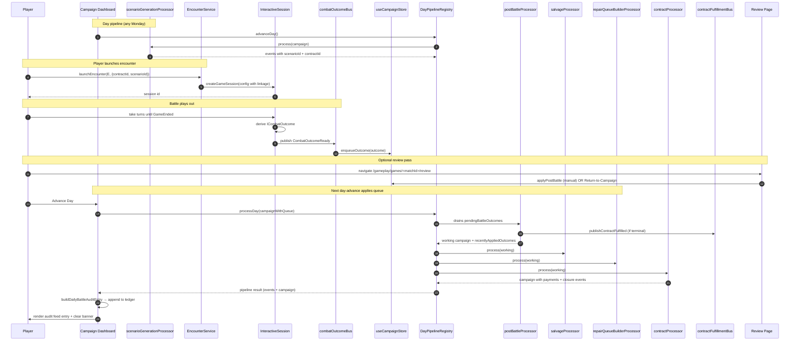

# Campaign Combat Loop

> **Source:** Closed by Slice 6 of `wire-encounter-to-campaign-round-trip`. This doc is the canonical narrative for how a single battle round-trip threads through MekStation's systems — from contract signing all the way back to the campaign dashboard.

## Audience

Engineers touching any of the following modules should read this doc first:

- `src/services/encounter/EncounterService.ts`
- `src/engine/InteractiveSession.ts` and `src/engine/combatOutcomeBus.ts`
- `src/stores/campaign/useCampaignStore.ts`
- `src/lib/campaign/processors/postBattleProcessor.ts`
- `src/lib/campaign/processors/salvageProcessor.ts`
- `src/lib/campaign/processors/repairQueueBuilderProcessor.ts`
- `src/lib/campaign/processors/contractProcessor.ts`
- `src/lib/campaign/dailyBattleAuditBuilder.ts`
- `src/components/gameplay/pages/campaigns/dashboard/`
- `src/pages/gameplay/games/[id]/review.tsx`

## High-Level Round Trip

```
Contract → Encounter → Session → Outcome → Queue → Day Pipeline → Campaign State
```

A successful round trip touches all seven stages exactly once:

1. **Contract** lives on `ICampaign.missions` keyed by id; status starts at `ACTIVE`.
2. **Encounter** is generated by `scenarioGenerationProcessor` (or hand-built via the encounter UI). When generated from a contract it carries `contractId` + `scenarioId`.
3. **Session** (`IGameSession`) is launched by `EncounterService.launchEncounter`, which forwards `encounterId`, `contractId`, `scenarioId` onto the session config.
4. **Outcome** (`ICombatOutcome`) is derived in `InteractiveSession` when `GameEnded` fires. It carries `matchId`, `contractId`, `scenarioId`, the per-unit deltas, the post-battle report, and the end reason.
5. **Queue**: the campaign store subscribes to the `CombatOutcomeReady` bus and idempotently appends to `pendingBattleOutcomes`.
6. **Day Pipeline** drains the queue through three battle-effects processors before any other day work runs:
   - `postBattleProcessor` (phase `MISSIONS - 50 = 350`) — pilot XP, wounds/KIA, unit damage state, contract status flip, fulfillment publish.
   - `salvageProcessor` (phase `MISSIONS - 25 = 375`) — per-outcome salvage allocation.
   - `repairQueueBuilderProcessor` (phase `MISSIONS - 10 = 390`) — repair tickets per damaged unit.
   - `contractProcessor` (phase `MISSIONS = 400`) — closes any contract whose status was just flipped to terminal: applies final payment, removes from active list.
7. **Campaign State** carries the new pilot stats, salvage records, repair tickets, finance transactions, and `dailyBattleAudit` entry. The dashboard's pending-outcomes banner empties; the audit feed gains a new entry.

## Sequence Diagram



## Stage Reference

### 1. Contract → Encounter (scenarioGenerationProcessor)

Runs weekly on Mondays when `useAtBScenarios` is enabled. For each active combat team on each active contract:

- `checkForBattle` decides whether a scenario is generated this week.
- If so, `selectScenarioType` picks the type, `calculateOpForBV` sizes the OpFor, and `generateRandomConditions` rolls light/weather.
- A deterministic `scenarioId = scn-<contractId>-<dateIso>-<teamId>` is stamped onto the event payload alongside the `contractId`. Wave 5 §8.1 ensures the encounter persistence layer (a Wave-7 follow-up) can preserve both ids on the resulting `IEncounter`.

### 2. Encounter Launch

`EncounterService.launchEncounter(E, opts)` validates that contract launches always carry `campaignId + contractId + scenarioId` (rejection happens via `validateContractLaunchLinkage`). The session config inherits all three fields; standalone launches inherit only `encounterId`.

### 3. Session Completion → Bus

`InteractiveSession` watches for the `GameEnded` event on its internal bus. On completion:

- It derives an `ICombatOutcome` from session state (winner, end reason, per-unit deltas, post-battle report).
- POSTs the outcome to `/api/matches` for durable persistence.
- Calls `publishCombatOutcome` on `combatOutcomeBus`. The bus is in-memory, synchronous, and idempotent on the publisher side (one publish per session).

### 4. Campaign Store Enqueue

The campaign store subscribes once on first construction (`subscribeToCombatOutcome`). On receipt:

- Skip if the matchId is already on `pendingBattleOutcomes` (in-flight dedupe).
- Skip if the matchId is already in `processedBattleIds` (already-applied dedupe — guards against retries and replays).
- Otherwise append to the queue and emit `PendingOutcomeAdded` so the unified event store records it.

### 5. Day Pipeline Phase Order

The `DayPipelineRegistry` sorts processors by `phase` value. The Wave-5 invariant for the battle-effects block is:

| Processor                       | Phase value | Reads                                | Writes                                                      |
| ------------------------------- | ----------- | ------------------------------------ | ----------------------------------------------------------- |
| `postBattleProcessor`           | 350         | `pendingBattleOutcomes`              | `personnel`, `missions`, `unitCombatStates`, `recentlyApplied` |
| `salvageProcessor`              | 375         | `recentlyAppliedOutcomes`            | `salvageAllocations`, `salvageReports`                       |
| `repairQueueBuilderProcessor`   | 390         | `recentlyAppliedOutcomes` + `unitCombatStates` | `repairQueue`                                       |
| `contractProcessor`             | 400         | `pendingFulfilledContractIds`        | `missions`, `finances`, `processedFulfilledContractIds`      |

Each processor's output campaign feeds the next.

### 6. Contract Fulfillment

Wave 5 §9 added a narrow in-process bus (`contractFulfillmentBus`) for downstream observers. The flow:

- `postBattleProcessor.applyContractDelta` flips `mission.status` to a terminal value (SUCCESS / PARTIAL / FAILED) when the outcome's `endReason` is terminal.
- If the flip is from a non-terminal status, the processor:
  - Appends the contractId to `pendingFulfilledContractIds`.
  - Calls `publishContractFulfilled` so any external listener (multiplayer sync, future faction-standing system) can react.
  - Emits a `contract_fulfilled` day event for the audit feed.
- `contractProcessor` walks `pendingFulfilledContractIds`, resolves the mission, computes `calculateTotalPayout` from its `IPaymentTerms`, records an `Income` transaction, emits a `contract_closed` day event, and moves the id from `pending` to `processedFulfilledContractIds`.

The pipeline phase ordering guarantees `contractProcessor` runs in the same `processDay` invocation as the post-battle flip.

### 7. Daily Battle Audit Card

After the pipeline returns, the campaign store calls `buildDailyBattleAuditEntry`. The builder:

- Reads `recentlyAppliedOutcomes` (canonical list of what post-battle drained today).
- Diffs `personnel.totalXpEarned` across before/after to derive total XP awarded.
- Walks the day's events to tally salvage value (`salvage_allocated.mercenaryValue`) and repair tickets (`repair-tickets-created.ticketCount`).
- Walks the outcome unit deltas to count Wounded / KIA / MIA pilots.
- Diffs `missions` to capture closed contract ids.

The entry is appended to `campaign.dailyBattleAudit`, persisted alongside the campaign, and rendered by the `DailyBattleAuditFeed` component on the dashboard. Each match is a clickable link to its review page (`/gameplay/games/<matchId>/review`).

## Error & Recovery Paths (Wave 5 §11)

| Scenario                                | Behaviour                                                                                                                                                                |
| --------------------------------------- | ------------------------------------------------------------------------------------------------------------------------------------------------------------------------ |
| Player quits mid-battle                 | No `GameEnded` event fires, so no `CombatOutcomeReady` is published. The pending queue is not touched. The session is naturally abandoned by the page lifecycle.         |
| Post-battle apply throws on one outcome | The throwing outcome stays in `pendingBattleOutcomes`. A `post_battle_apply_failed` event is emitted, and the store mirrors the error message into `outcomeApplyErrors`. |
| Player wants manual retry               | The review page surfaces the recorded error and a "Retry application" button. `useCampaignStore.retryOutcomeApplication(matchId)` re-runs `applyPostBattle` directly.    |
| Next day-advance after a recorded error | The processor naturally retries the still-queued outcome. On success the matchId leaves the queue and the error map is pruned.                                           |

## Cross-Cutting Invariants

- **Idempotency** is enforced at multiple layers: the bus publisher (one publish per session), the store enqueue (matchId dedupe vs queue + processed ledger), and the processor (skip if `processedBattleIds.includes(matchId)`).
- **Phase ordering** is the single source of truth for "what runs when" — never call processors directly from one another. Use `recentlyAppliedOutcomes` and `pendingFulfilledContractIds` as transient hand-off fields.
- **Linkage** (`encounterId / contractId / scenarioId`) flows top-down from contract → encounter → session config → outcome. Each layer rejects partial linkage from a contract source.

## Related Specs

- `openspec/specs/scenario-generation` — Wave-5 delta added scenario+contract id linkage.
- `openspec/specs/game-session-management` — Wave-5 delta added bus contract + queue idempotency.
- `openspec/specs/contract-types` — Wave-5 delta added the `ContractFulfilled` event + contractProcessor closure.
- `openspec/changes/wire-encounter-to-campaign-round-trip` — the originating change document. Slice 6 closed the §7 / §8.1 / §9 / §11 / §12 task groups; Slice 7 will add §10 integration + E2E tests.
