# MekStation QC Map

Date: 2026-06-19

This map is the durable review surface for post-merge quality control. It is
organized by user/risk surface first, then module and submodule, so future QC
requests can start from a stable lane instead of re-discovering the repo.

The machine-readable source is `docs/qc/mekstation-qc-registry.json`. The
repeatable pass/fail scenario layer for the 12 top-level QC surfaces is
`docs/qc/mekstation-major-capability-scenarios.json`.
The journey-level validation layer is `docs/qc/mekstation-journey-scenarios.json`,
with graph lookup in `docs/qc/mekstation-qc-validation-graph.json`, gameplay UI
flow shell mapping in `src/qc/gameplayUiFlowShell.json`, and logging
coverage in `docs/qc/mekstation-logging-map.json`.
Use `qc:ui-flow-shell` when the question is how a journey maps to the
player/GM route checkpoints on the gameplay hub, and use
`qc:ui-flow-shell:validate` to fail fast when a checkpoint no longer maps to a
Next.js page template or required journey sequence.

## Commands

```powershell
npm.cmd run qc:validate
npm.cmd run qc:select -- --status=partial
npm.cmd run qc:select -- --risk=rules-parity
npm.cmd run qc:select -- --lens=ux
npm.cmd run qc:select -- --claim=ui.tactical.movement-preview
npm.cmd run qc:select -- --claim=combat.catalog.battlemech
npm.cmd run qc:select -- --module=src/components/gameplay
npm.cmd run qc:select -- --submodule=movement
npm.cmd run qc:select -- --text=tactical
npm.cmd run qc:run -- --surface=gameplay-tactical-map-combat --quick
npm.cmd run qc:scenarios:validate
npm.cmd run qc:scenarios -- --tier=core
npm.cmd run qc:scenarios -- --surface=gameplay-tactical-map-combat --tier=standard
npm.cmd run qc:journeys:validate
npm.cmd run qc:ui-flow-shell:validate
npm.cmd run qc:ui-flow-shell -- --journey=contract-campaign
npm.cmd run qc:tactical:projection:validate
npm.cmd run qc:tactical:projection
npm.cmd run qc:logging:validate
npm.cmd run qc:graph -- --query=mek-build
npm.cmd run qc:journeys -- --journey=all --tier=smoke
npm.cmd run qc:campaign-long:stability -- --journey=campaign-long --seed=42 --contracts=10 --runs=2
npm.cmd run qc:journeys:bugs -- --since=latest --min-severity=medium
npm.cmd run qc:logs -- --run-id=latest --level=warn,error
npm.cmd run qc:logs -- --run-id=latest --level=warn,error --exclude-probes
npm.cmd run verify:qc:scenarios
npm.cmd run verify:qc:journeys
npm.cmd run verify:qc:ui-flow-shell
npm.cmd run verify:qc:campaign-long
npm.cmd run verify:qc:partial:quick
npm.cmd run verify:qc:tactical:projection
npm.cmd run verify:qc:tactical:quick
npm.cmd run verify:qc:tactical:visual
npm.cmd run verify:qc:combat
npm.cmd run verify:qc:maintenance
npm.cmd run maintain:scan:gate
node scripts/qc/validate-maintenance-warning-ledger.mjs
npm.cmd run maintain:scan -- --scope=src --format=summary
npm.cmd run verify:qc
npm.cmd run verify:rules
```

Use the plain `warn,error` log scan to audit every warning-class event,
including harness controls. Use `--exclude-probes` for the operator view that
omits expected negative-control probes such as `api.payload_rejected`.
Use `qc:campaign-long:stability` when the question is whether a deterministic
6-10 contract campaign repeats cleanly, survives JSON save/load evidence
round-trips, and exposes drift through `stability-manifest.json`, `bugs.json`,
and searchable stability logs.

## Graph

```mermaid
flowchart TD
  A["MekStation QC Registry"]
  A --> B["App Shell / Navigation / Settings / PWA"]
  A --> C["Compendium / Unit Data"]
  A --> D["Customizer / Construction / BV / Export"]
  A --> E["Force / Pilot / Encounter Setup"]
  A --> F["Gameplay Tactical Map / Combat UI"]
  A --> G["Simulation / Combat Validation"]
  A --> H["Campaign Economy / Progression"]
  A --> I["Multiplayer / Co-op / Sync"]
  A --> J["Replay / Audit / History"]
  A --> K["Desktop / API / Security"]
  A --> L["OpenSpec / CI / Quality Gates"]
  A --> M["Maintenance Code Health"]

  F --> F1["Rules Explanation Layer"]
  F --> F2["Top-Down Hex Legibility"]
  F --> F3["Movement Preview Agreement"]
  F --> F4["Combat Preview Agreement"]
  F --> F5["Rotatable Isometric 2.5D"]

  G --> G1["BattleMech Catalog Validation"]
  G --> G2["Behavior-Class Rule Tests"]
  G --> G3["Runner / Interactive Parity"]
  G --> G4["Known Gap Honesty"]
  G --> G5["Physical Weapon Runtime Boundary"]
  G --> G6["Ejection Lifecycle Regression"]
  G --> G7["Non-BattleMech Scope Matrix"]
```



## QC Lenses

| Lens            | What It Checks                                                                              |
| --------------- | ------------------------------------------------------------------------------------------- |
| usability       | Can a player understand and complete the workflow?                                          |
| ui              | Is the visual state readable, stable, and non-overlapping?                                  |
| ux              | Does the flow explain intent, constraints, and recovery paths?                              |
| functionality   | Does the feature work end-to-end?                                                           |
| rules-parity    | Does behavior match source-backed BattleTech/MegaMek/MekHQ authority or expose a named gap? |
| accessibility   | Does the interface avoid color-only meaning and support keyboard/screen-reader basics?      |
| security        | Are API, desktop, IPC, and package-runtime boundaries safe?                                 |
| test-quality    | Do tests prove the claim without skips, tautologies, or hidden suppressions?                |
| maintainability | Is the code shaped so future changes stay local and reviewable?                             |

## Current Hot Lanes

1. `gameplay-tactical-map-combat`
   - Tactical map is the primary explanation layer; Wave 7 adds a fast
     projection parity manifest that validates required tactical surfaces,
     commands, source anchors, browser-boundary coverage, and stale
     active-change refs.
   - Claim IDs route exact QC asks such as `ui.tactical.rules-explanation`,
     `ui.tactical.movement-preview`, `ui.tactical.combat-preview`,
     `ui.tactical.topdown-legibility`, and `ui.tactical.isometric-25d`.
   - Validate first with `qc:tactical:projection:validate`, then tactical-map
     unit scenarios and Playwright visual smoke for deeper behavior/visual
     signoff.

2. `simulation-combat-validation`
   - BattleMech unresolved validation gaps are currently 0 by
     `validate:combat:gaps -- --format=summary`.
   - Current out-of-scope combat rows are 140 by
     `validate:combat:gaps -- --level=out-of-scope --format=summary`; keep
     non-BattleMech systems and unsupported runtime boundaries split into
     separate matrices.
   - Physical weapon runtime boundaries and ejection lifecycle regressions are
     now first-class QC sublanes so stale gap wording does not override live
     validators.
   - Claim IDs route exact QC asks such as `combat.catalog.battlemech`,
     `combat.behavior-class`, `combat.integration.parity`,
     `combat.physical-boundary`, `combat.gaps.honesty`, and
     `combat.scope.non-battlemech`.

3. `integration-runner-interactive-parity`
   - Runner/interactive parity is still the highest-risk combat integration
     lane, especially physical attack commit and phase-driver behavior.

4. `multiplayer-coop-sync`
   - Current dirty worktree includes multiplayer API and fog test edits.
   - Treat those edits as external work until validated.

5. `maintenance-code-health`
   - Full maintenance scanner pass is active with a reviewed `src` regression
     baseline; the current `src` scanner gate has 0 critical/high findings.
   - Use `maintain:scan:gate` to block new `src` critical/high findings, and
     use `node scripts/qc/validate-maintenance-warning-ledger.mjs` to confirm
     repo-wide Wave 12 findings are fixed, accepted, or follow-up tracked.
   - Repo-wide non-`src` script, desktop, and e2e page-object findings remain
     in `docs/qc/maintenance-warning-ledger.json` instead of being treated as
     hidden pass/fail suppressions.
   - Stale TODOs are currently zero actionable findings after explanatory e2e
     comments were rewritten and recent skipped-test `fixme` trackers stayed
     explicit.
   - Broad public barrels remain import-health warnings; circular import chains
     are the next high-risk import-health remediation wave.
   - Near-duplicate findings are cluster-level now; overlapping 5-line windows
     no longer inflate the high count.
   - Duplicate scanning now ignores block-comment delimiters and public
     `index.ts` barrels, while broad barrels remain visible through
     import-health warnings.
   - Construction, vehicle customizer, critical-slots, dialogs, and armor
     variants now report 0 critical/high findings after focused maintenance
     waves.
   - Battle armor, infantry, ProtoMech, and vehicle BV tests are split into
     focused suites, clearing construction test file-bloat without dropping
     BV assertions.
   - Unit handler design-violation findings are cleared; remaining handler
     work is test file-bloat and near-duplicate extraction.
   - HexMapDisplay, movement utilities, and physical attack utilities have
     had first-pass complexity/design cleanup, but each still has active
     raw critical/high queues.
   - Detector damage event helpers now use typed fixture objects; the targeted
     detector code-smell scan is clean.
   - Combat validation catalog contract assertions now use named proof helpers;
     the targeted runner test code-smell scan is clean.
   - Engine movement and attack-projection scenario tests now avoid broad
     describe wrappers; the targeted engine test complexity scan is clean.
   - Keyboard navigation index math now lives in pure helpers; the hook test
     suite passes and the hook no longer appears in critical complexity output.
   - Vault folder repository tests now route SQL mocks through named statement
     configurers; the targeted vault test complexity scan is clean.
   - Simulation runner/combat integration tests now avoid broad outer wrappers;
     the targeted simulation test complexity scan has no critical findings.
   - Atlas hydration tests now avoid the broad Atlas wrapper; the focused
     hydration suite passes and the runner test complexity slice dropped by
     one critical finding.
   - Combat action support contract tests now avoid the broad catalog wrapper;
     the focused contract suite passes and the runner test complexity slice
     dropped by one additional critical finding.
   - Combat validation requirement crosswalk tests now avoid the broad catalog
     wrapper; the focused contract suite passes and the runner test complexity
     slice dropped by one additional critical finding.
   - Pilot modifier application, critical-hit event, physical attack behavior,
     and weapon attack event tests now avoid broad wrappers where safe; focused
     suites pass and the runner test complexity slice dropped from 17 to 12.
   - Pilot modifier contract helpers now use explicit exception/source-ref
     tables, BattleMech combat catalog proof helpers are extracted, and broad
     combat validation/event/indirect-fire wrappers are flattened; the runner
     test complexity slice has zero remaining critical/high findings.
   - Movement reachability tests now avoid the broad `deriveReachableHexes`
     wrapper; the focused 103-test suite passes and the targeted movement test
     complexity scan is clean.
   - Tactical-map movement scenario tests now avoid their broad outer wrapper;
     the focused 22-test scenario suite passes and the targeted testing
     complexity scan is clean.
   - Handler integration tests now use an explicit unit-type fixture lookup
     table instead of a broad switch; the focused 29-test suite passes and the
     targeted handler design scan is clean.
   - Command preview hook tests now keep shared command handles at file scope;
     the focused 13-test suite passes and the targeted TacticalActionDock test
     complexity scan is clean.
   - Name-mapping validation tests now keep shared catalog setup at file scope;
     the focused 7-test suite passes and the targeted construction test
     complexity scan is clean.
   - Unit serializer tests now keep the mock unit helper at file scope while
     preserving serializer API groupings; the focused 26-test suite passes and
     the targeted serializer test complexity scan is clean.
   - Equipment lookup service tests now avoid their broad outer wrapper while
     preserving lookup/filtering/data-integrity groupings; the focused 37-test
     suite passes and `src/__tests__` complexity is now clean.
   - MM data asset service tests now avoid their broad outer wrapper while
     preserving SVG loading/path/configuration groups; the focused 67-test
     suite passes and the targeted asset-service test complexity scan is clean.
   - Encounter service tests now route mocked repository create/update behavior
     through named helpers; the focused 49-test suite passes and the targeted
     encounter service test complexity scan is clean.
   - Vehicle critical hit resolution now uses a generic 2d6 data table; the
     focused 38-test vehicle critical hit suite passes and the critical
     `vehicleCritFromRoll` code-smell finding is removed.
   - Slot operations now use fixed-slot collector and unhittable-fill helpers;
     the focused 12-test slot operation suite passes and the targeted
     slotOperations scanner slice has zero critical/high findings.
   - Capital transport bay parsing now uses a shared rule-driven parser with
     per-handler rule tables; the focused DropShip, JumpShip, WarShip, and
     SpaceStation handler suites pass with 141 tests and duplicated critical
     transporter parsing branches are removed.
   - GameOutcomeCalculator now resolves outcome precedence through small
     decision helpers; the focused 21-test outcome calculator suite passes and
     one critical `calculateGameOutcome` nesting finding is removed.
   - ParityValidationHelpers now routes critical slot mismatch categorization
     through focused issue builders; the focused 17-test helper suite passes
     and one critical `compareCriticalSlots` nesting finding is removed.
   - CanonicalUnitService now maps tech base, tonnage, and era through pure
     table-driven helpers; the focused 26-test service suite passes and one
     critical `mapRawToIndexEntry` nesting finding is removed.
   - UnitLoaderService component mappers now route engine types through a
     normalized lookup, assign armor by location key, and route armor allocation
     entries through focused value/rear-armor helpers; the focused 28-test
     mapper suite passes and the component mapper slice has no remaining
     critical/high findings.
   - UnitLoaderService armor tonnage now uses explicit counted-field,
     points-per-ton, and half-ton rounding helpers; the focused 8-test armor
     calculation suite passes and one high `calculateArmorTonnage` nesting
     finding is removed.
   - UnitLoaderService equipment resolution now routes direct variant lookup,
     mixed-tech critical-slot hints, unit-preferred variants, and registry alias
     fallback through focused helpers; the focused 18-test resolution suite
     passes and one high `resolveEquipmentId` complexity finding is removed.
   - UnitLoaderService state mapping now composes pure identity, configuration,
     component, heat sink, armor, and equipment derivation helpers; the focused
     38-test loader suite passes and one high `mapToUnitState` complexity
     finding is removed.

- EventLogDisplay now keeps event formatting in a dedicated formatter module
  with table-driven icon and priority maps; the focused 21-test event-log
  slice passes and the raw scanner baseline drops by six findings.
- CompendiumAdapter movement profile classifiers now use table-driven
  lookup sets/maps and optional state assembly helpers; the focused
  111-test adapter suite passes and the raw scanner baseline drops by nine
  findings.
- Combat event factories now split attack, damage, and indirect-fire payload
  builders across focused modules with object-input-compatible signatures; the
  focused factory, damage, indirect-fire, and catalog suites pass and the raw
  scanner baseline drops by twelve findings.
- Battle armor event factories now split casualty, swarm, leg-attack, and
  stealth payload builders behind the existing barrel with
  object-input-compatible signatures; the focused interactive scenario and
  catalog suites pass and the raw scanner baseline drops by eight findings.
- Status-check, small, movement, status, physical, and vehicle event factories
  now use focused modules and object-input-compatible signatures while
  preserving positional callers; the gameEvents scanner slice reports 0
  critical/high findings and the raw scanner baseline drops to 1127.
- Objective lifecycle event factories now support object-input-compatible
  signatures while preserving existing positional callers; the objectives
  code-smell slice reports 0 critical/high findings and the raw scanner
  baseline drops to 1125.
- Vehicle armor max helpers now accept a named armor profile object while
  preserving positional compatibility; the customizer vehicle code-smell slice
  reports 0 critical/high findings and the raw scanner baseline drops to 1123.
- Battle armor trooper mass calculation now accepts a named mass input object
  while preserving positional compatibility; the battlearmor construction
  code-smell slice reports 0 critical/high findings and the raw scanner
  baseline drops to 1122.
- Called-shot modifier calculation now accepts a named input object while
  preserving positional compatibility; focused to-hit tests pass and the raw
  scanner baseline drops to 1121.
- Replay event overlay payload summaries now use a flat value formatter; the
  audit replay code-smell slice reports 0 critical/high findings and the raw
  scanner baseline drops to 1120.
- Create campaign submission now lives in a focused submit helper module while
  the page keeps wizard orchestration; the create-campaign code-smell slice
  reports 0 critical/high findings and the raw scanner baseline drops to 1118.
- Tactical map projection explanations now assemble movement, stand-up, combat,
  weapon impact, cover, C3, and LOS-blocker text through focused helpers; the
  focused projection suite passes and the raw scanner baseline drops to 1117.
- Damage resolution finalization now lives in a focused module while
  `resolve.ts` remains the damage entrypoint; the focused damage and
  critical-hit suites pass, the damage code-smell slice clears, and the raw
  scanner baseline drops to 1115.
- Damage location application now keeps armor/structure bookkeeping in a
  focused helper module while `location.ts` remains the transfer-facing
  entrypoint; focused damage and critical-hit suites pass, the damage scanner
  slice reports 0 critical/high findings, and the raw scanner baseline drops to 1114.
- Critical-hit resolution now splits slot effect classification, predicate
  helpers, resolver state, and actuator lookup tables; focused critical-hit and
  damage lifecycle suites pass, the targeted critical-hit scanner slice reports
  0 critical/high findings, and the raw scanner baseline drops to 1103.
- Game-state damage replay now routes critical-hit component, equipment,
  electronic-warfare, and vehicle envelope updates through focused helpers;
  focused critical-hit/replay suites pass, the `gameState` scanner slice drops
  to 10 critical/high findings, and the raw scanner baseline drops to 1098.
- Game-state combatState initialization now delegates per-unit combat envelope
  construction to a focused helper module; focused initialization/game-state
  suites pass, the `gameState` scanner slice drops to 9 critical/high findings,
  and the raw scanner baseline drops to 1097.
- Minefield replay now routes MinefieldChanged operations through table-driven
  handlers; focused game-state and combat catalog suites pass, the `gameState`
  scanner slice drops to 8 critical/high findings, and the raw scanner baseline
  drops to 1096.
- Physical attack resolution replay now lives in a focused helper module;
  focused physical/game-state and catalog-contract suites pass, the `gameState`
  scanner slice drops to 7 critical/high findings, and the raw scanner baseline
  drops to 1095.
- Game-state event dispatch now lives in a focused registry module; focused
  reducer/physical and catalog-contract suites pass, the `gameState` scanner
  slice drops to 4 critical/high findings, and the raw scanner baseline drops
  to 1092.
- Extended combat replay now lives in focused piloting, status, and unit-exit
  modules behind the compatibility barrel; focused replay/catalog suites pass,
  the `gameState` scanner slice drops to 2 critical/high findings, and the raw
  scanner baseline drops to 1090.
- Runtime movement-state and combat-state initialization tests now use shared
  fixtures plus focused behavior files; focused suites pass, the `gameState`
  scanner slice reports 0 critical/high findings, and the raw scanner baseline
  drops to 1088.
- Post-combat runner phases now split PSR and heat resolution across focused
  PSR, heat accounting, heat lifecycle, and event helper modules; focused
  PSR/heat and catalog-contract suites pass, and the raw scanner baseline drops
  to 1083.
- Movement terrain skid modifier logic now uses a table-driven threshold lookup;
  movement behavior and catalog-contract suites pass, and the raw scanner
  baseline drops to 1082.
- Engine phase and AI dispatch now use early-return phase branches and focused
  AI phase helpers; focused engine suites pass, the `src/engine` code-smell
  critical slice clears, and the raw scanner baseline drops to 1079.
- UnitHydration active-probe classification now uses ordered fallback
  predicates; active-probe hydration/catalog/critical-event suites pass, source
  references are repinned, and the raw scanner baseline drops to 1078.
- SPA designation handoff now collects pilot designations through guard-return
  helpers; focused SPA and pilot-modifier catalog suites pass, attacker SPA
  aggregation source refs are repinned, and the raw scanner baseline drops to 1077.
- Award store specific-event matching now uses a focused companion helper
  module with flat predicates; the award store suite passes with existing React
  act warnings, the stores code-smell critical slice clears, and the raw scanner
  baseline drops to 1074.
- Attack resolution hit handling now routes damage, critical, PSR, pilot, and
  destruction event emission through focused helpers; 72 focused
  attack/damage/ammo/arc and vehicle tests pass, the `resolveAttack`
  nesting/complexity criticals are removed, and the raw scanner baseline drops
  to 1072.
- Heat phase resolution now routes per-unit source accounting, dissipation,
  startup/shutdown, ammo cookoff, pilot heat damage, and MaxTech heat critical
  handling through focused helpers with named heat cascade event factory
  inputs; 74 focused heat tests pass, the `resolveHeatPhase`
  nesting/complexity criticals and two high event-factory parameter findings
  are removed, and the raw scanner baseline drops to 1068.
- Pending PSR resolution now lives in a focused `gameSessionPSRResolution`
  module re-exported by `gameSessionPSR`; 179 focused PSR tests pass, the
  `resolvePendingPSRs` critical complexity finding is removed without a new
  file-bloat finding, and the raw scanner baseline drops to 1067.
- PSR reason category classification now uses an exhaustive typed lookup
  table; 131 focused PSR taxonomy/resolution tests pass, the
  `getPSRReasonCategory` critical complexity finding and one high design
  finding are removed, and the raw scanner baseline drops to 1065.
- PSR modifier resolution now lives in a focused `modifierResolution` module
  behind compact resolver adapters; 155 focused PSR tests and 73
  catalog-contract tests pass, the `calculatePSRModifiers` critical complexity
  finding, terrain classification switch design finding, and three high
  parameter-count findings are removed, and the raw scanner baseline drops to 1060.
- To-hit calculation now accepts named inputs behind positional-compatible
  adapters and routes modifier families through focused collectors; 721 focused
  to-hit/C3/SPA/quirk tests and 92 catalog-contract tests pass, the `toHit`
  scanner slice reports 0 critical/high findings, `validate:combat` remains
  green, and the raw scanner baseline drops to 1057.
- Runner phase `createGameEvent` now accepts named event-envelope input behind
  a positional-compatible adapter; 12 focused event-envelope/replay-source
  tests and typecheck pass, the runner phases scanner slice drops to 25
  critical/high findings, and the raw scanner baseline drops to 1056.
- Ammo explosion critical handling now iterates `criticalEvents` through an
  empty-array default instead of a nested guard; 158 focused critical-hit,
  heat, and catalog tests pass, the runner phases scanner slice drops to 24
  critical/high findings, and the raw scanner baseline drops to 1055.
- Physical attack damage application now lives in a focused companion module
  with helper seams for critical context, critical state effects, and physical
  damage/destroyed event emission; 404 focused physical-combat and catalog
  tests pass, the runner phases scanner slice drops to 23 critical/high
  findings, and the raw scanner baseline drops to 1054.
- Weapon attack critical event emission now lives in a focused helper module
  re-exported through `weaponAttackHelpers`; 200 focused critical-hit, damage
  lifecycle, weapon attack event, and catalog tests pass, the runner phases
  scanner slice drops to 21 critical/high findings, and the raw scanner
  baseline drops to 1052.
- Movement terrain PSR collection now routes water, terrain, swamp, building,
  and skidding checks through focused collector helpers; 173 focused movement
  terrain and catalog tests pass, the runner phases scanner slice drops to 20
  critical/high findings, and the raw scanner baseline drops to 1051.
- Weapon hit resolution now routes zero-projectile, partial-cover, designator
  marker, plasma, Edge, damage adjustment, manifest, and equipment-critical
  state branches through focused helpers; 255 focused weapon-hit and catalog
  tests pass, the runner phases scanner slice drops to 19 critical/high
  findings, and the raw scanner baseline drops to 1050.
- Movement phase execution now keeps `runMovementPhase` as a compact
  orchestrator and routes per-unit movement decisions plus committed movement
  side effects through focused helpers; 331 focused movement and catalog tests
  pass, the runner phases scanner slice drops to 17 critical/high findings,
  and the raw scanner baseline drops to 1048.
- Weapon firing mode projectile resolution now lives in focused classifier and
  projectile helper modules while `weaponAttackFiringModes` remains the public
  import surface; 147 focused firing-mode, weapon-event, and catalog tests
  pass, the runner phases scanner slice drops to 16 critical/high findings,
  and the raw scanner baseline drops to 1047.
- Weapon attack partial-cover tests now keep hit-resolution fixture
  construction in a sibling fixture module; 12 focused partial-cover tests
  pass, the runner phases scanner slice drops to 15 critical/high findings,
  and the raw scanner baseline drops to 1046.
- Heat-induced ammo explosion cascade event emission now uses a named heat
  event append helper for damage, location-destroyed, and transfer events; 69
  focused heat tests pass, the runner phases scanner slice drops to 13
  critical/high findings, and the raw scanner baseline drops to 1044.
- Movement control PSR now uses a normalized BattleMech-like unit-type set and
  named PSR event append helper; 224 focused movement tests pass, the runner
  phases scanner slice drops to 11 critical/high findings, and the raw scanner
  baseline drops to 1042.
- Runner phase `UnitDestroyed` event emission now uses a named append helper
  across heat, movement, physical, post-combat PSR, and weapon-hit destruction
  paths; 520 focused destruction-event tests pass, the runner phases scanner
  slice drops to 10 critical/high findings, and the raw scanner baseline drops
  to 1041.
- Runner phase `PSRTriggered` event emission now uses a named append helper
  across heat, movement-enhancement, physical-critical, and weapon leg-damage
  PSR paths; 518 focused PSR event tests pass, the runner phases scanner slice
  drops to 9 critical/high findings, and the raw scanner baseline drops to 1040.
- Runner phase `AttackResolved` event emission now uses a named append helper
  across weapon miss, hit, early-return, plasma, and designator paths; 113
  focused weapon tests pass, the runner phases scanner slice drops to 8
  critical/high findings, and the raw scanner baseline drops to 1039.
- Weapon attack critical ammo explosion options now use named readonly
  option/result interfaces; 113 focused weapon tests pass, runner phase
  near-duplicate findings are now zero, the runner phases scanner slice drops to
  7 critical/high findings, and the raw scanner baseline drops to 1038.
- Movement minefield damage/event helpers now split BattleMech mine damage side
  effects from represented minefield selection; 251 focused movement, physical,
  terrain catalog, and tactical projection tests plus 99 focused catalog tests
  pass after source-reference repin.
- Physical attack arm-weapon fired selection now lives behind a flat helper; 626
  focused physical attack tests pass, the physical attack nesting critical is
  removed, and the runner phases scanner slice drops to 6 critical/high
  findings.
- Weapon attack indirect-fire side events and miss handling now live in focused
  helpers; 109 focused weapon tests pass, runAttackPhase nesting is demoted from
  critical to high, and the raw scanner baseline drops to 1037.
- `gameSessionPhysical` physical attack restriction dispatch now uses a typed
  resolver table; 158 focused physical declaration/resolution tests pass, the
  `declarePhysicalAttack` nesting critical is removed, and the raw scanner
  baseline drops to 1036.
- `gameSessionPhysical` physical attack damage and PSR event emission now live
  in focused helper modules; 158 focused physical declaration/resolution tests
  pass, the `resolveAllPhysicalAttacks` nesting critical is removed, and the raw
  scanner baseline drops to 1035.
- Equipment BV normalization now routes ordered catalog/name/alias/pattern
  candidates through focused lookup helpers; 83 focused equipment BV
  normalization/resolver tests pass, the targeted equipmentBV scanner slice has
  0 critical/high findings, and the raw scanner baseline drops to 1034.
- Record-sheet fixed slot content now uses fixed lookup tables and a compact
  center-torso band resolver; 53 focused record-sheet critical-slot rendering
  tests pass, the targeted record-sheet scanner slice has no critical findings,
  and the raw scanner baseline drops to 1033.
- `LocationMappings` parseLocation now uses ordered rear/fuzzy location rules;
  63 focused conversion location tests pass, conversion-service complexity
  findings are cleared, and the raw scanner baseline drops to 1032.
- Random force generation now delegates budget bounds, affordable selection,
  chassis-cap eviction, and force assembly to focused helpers; 25 focused
  random-force and swarm unit-count tests pass, and the raw scanner baseline
  drops to 1031.
- `HexCell.labels` terrain badges now use a table-driven badge lookup instead
  of a switch; 8 focused terrain label tests pass, and the raw scanner baseline
  drops to 1029.
- Equipment placement location restrictions now use an exhaustive predicate
  table instead of a switch; 16 focused location-restriction tests pass, and the
  raw scanner baseline drops to 1027.
- Variable equipment formula validation now routes formula families through
  small validators instead of a switch; 29 focused formula registry/validation
  tests pass, and the raw scanner baseline drops to 1025.
- Pilot designation helpers now use table-driven legacy designation and
  effect-parameter resolvers; 24 focused pilot type tests pass, the pilot-type
  scanner slice reports 0 critical/high findings, and the raw scanner baseline
  drops to 1023.
- Force type helper metadata now uses slot-count and display-name lookup tables;
  10 focused force helper tests pass, the force-type scanner slice reports 0
  critical/high findings, and the raw scanner baseline drops to 1021.
- Combat location helpers now use transfer and rear-front lookup tables; 25
  focused combat location helper tests pass, the gameplay-type scanner slice has
  only file-bloat findings remaining, and the raw scanner baseline drops to 1020.
- UnitLocation now uses a typed unit-location lookup table; 19 focused
  construction location helper tests pass, the construction-type scanner slice
  drops by one high switch-design finding, and the raw scanner baseline drops to 1019.
- Construction configuration helpers now reduce the registry public-method
  surface and share location/slot metadata; 160 focused construction tests pass,
  the construction-type scanner slice reports 0 critical/high findings.
- Repair assessment now accepts named damage-assessment input and the large
  repair test suite is split into focused files; the repair-type scanner slice
  reports 0 critical/high findings.
- Unit mounted-equipment interfaces now share a type-only identity base; the
  unit-type scanner slice reports 0 critical/high findings.
- HexCell invalid badges now use resolver and lookup tables for movement/combat
  invalid labels; the HexMapDisplay slice drops by three critical/high findings.
- Current raw scanner count is 0 critical/high findings after the latest
  post-merge maintenance waves, scanner calibration, and QC registry repair.
- `qc:validate` now checks repo-resolvable module, spec, test, and path-like
  evidence references, and stale tactical/combat/security anchors were repaired
  before continuing cleanup.
- `package.json` now exposes `verify:qc` for registry plus maintenance-gate
  proof and `verify:rules` for combat gaps, combat suite, and OpenSpec strict
  proof; `qc:run` executes registry-selected lane commands with quick/browser
  filters, and section aliases cover partial, UI, UX, rules, tactical, combat,
  and maintenance validations on demand. `verify` runs the stable unit/a11y
  surface, while `verify:full` also runs perf-sensitive simulation proofs
  before rules and build.
- `qc:scenarios` runs the 12 top-level major-capability scenarios with a
  consistent pass/fail method and timestamped evidence under
  `.sisyphus/evidence/qc-scenarios`; use `--tier=core` for quick section checks,
  `--tier=standard` for focused realistic flows, and `--tier=all` when
  diagnostic inventory should be captured too.
- Do not start broad cleanup until scanner findings are grouped.

## Acceptance Rule

A QC lane is ready only when:

- `qc:validate` passes, including repo-reference checks for concrete paths and
  globs.
- The lane has current module, test, command, manual check, evidence, and gap
  entries.
- Automated checks pass or failures are linked to explicit, current gaps.
- UI/UX claims have browser or manual inspection evidence.
- Rules claims cite source-backed tests or are explicitly scoped out.
